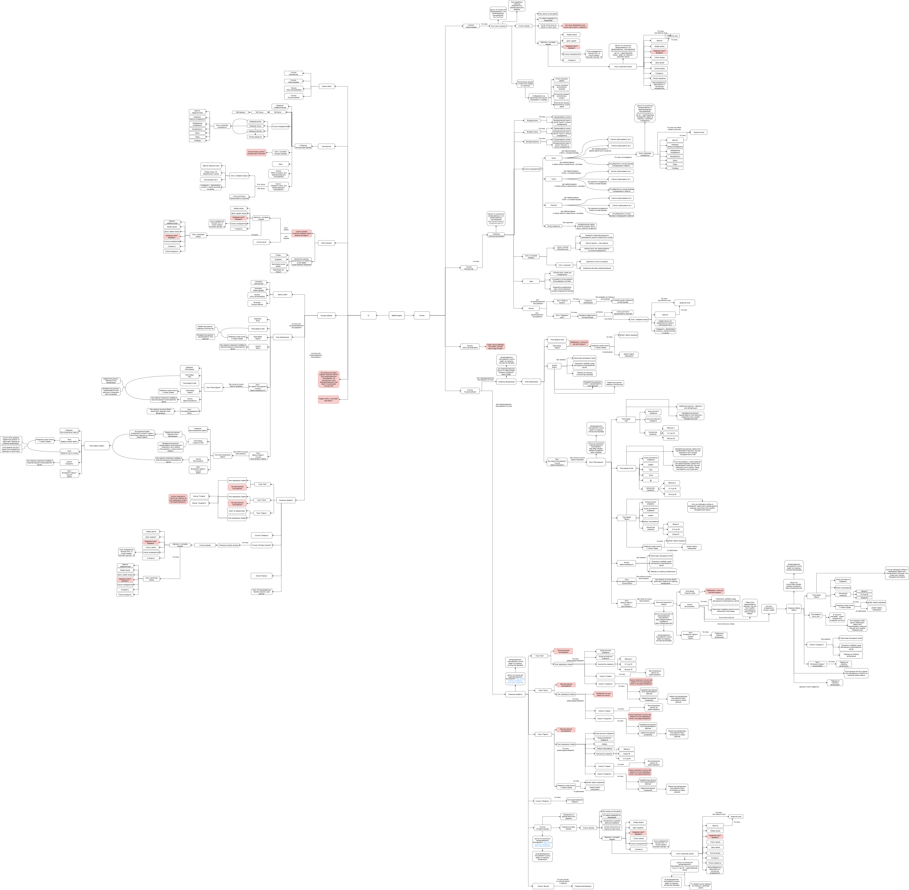

# 🗺️ Mind Maps для тестирования Stellar Burgers

Здесь собраны визуализации тестового покрытия и архитектуры приложения Stellar Burgers.

## 📊 Основная майнд-карта

**Технические характеристики:**
- Разрешение: 6990 × 6851 пикселей
- Формат: PNG с прозрачностью
- Обновлено: 10.12.2025

**Назначение:** Визуализация всех областей тестирования приложения, включая функциональные модули, интеграционные точки и нефункциональные требования.

## 🔗 Ссылки на файлы

### Полная версия для детального изучения:
[🔍 Открыть в максимальном качестве](
https://raw.githubusercontent.com/evstratovalana-rgb/qa_portfolio/refs/heads/main/stellar-burgers-testing/mindmaps/mindmap_Stellar_Burgers.png)

### Исходные файлы:
| Файл | Назначение | Размер |
|------|------------|--------|
| [mindmap_Stellar_Burgers.png](mindmap_Stellar_Burgers.png) | Изображение для просмотра | 3.09 МБ |

## 🛠️ Как работать с файлами

### Для просмотра:
1. Откройте PNG файл в любом просмотрщике изображений
2. Или используйте [raw-ссылку](https://raw.githubusercontent.com/evstratovalana-rgb/qa_portfolio/refs/heads/main/stellar-burgers-testing/mindmaps/mindmap_Stellar_Burgers.png) для полного качества

## 📈 Методология создания

Майнд-карта создана с использованием техник тест-дизайна:
- **Анализ эквивалентных классов** — группировка сходных сценариев
- **Граничные значения** — выделение крайних состояний
- **Причинно-следственный анализ** — выявление зависимостей
